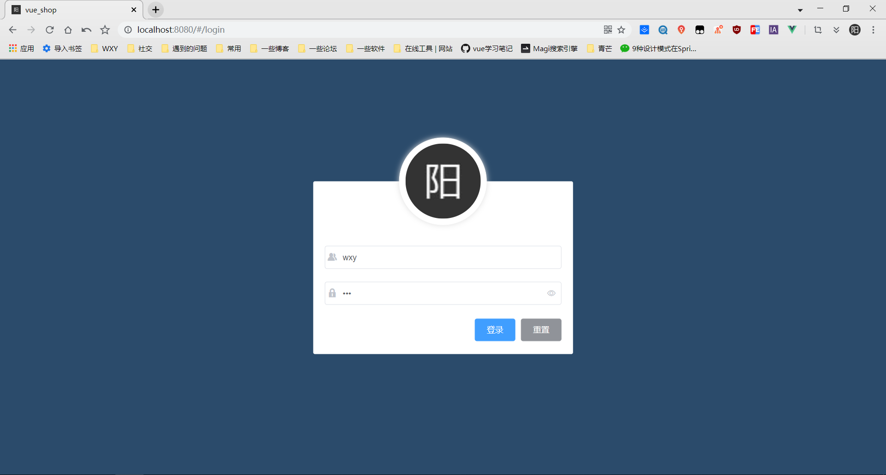
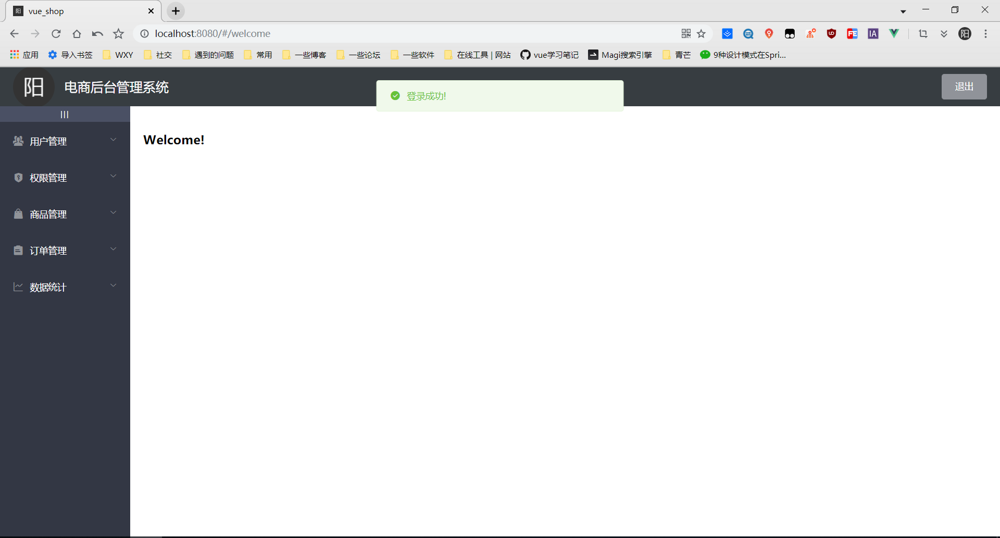
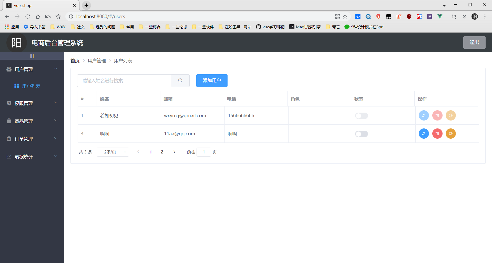
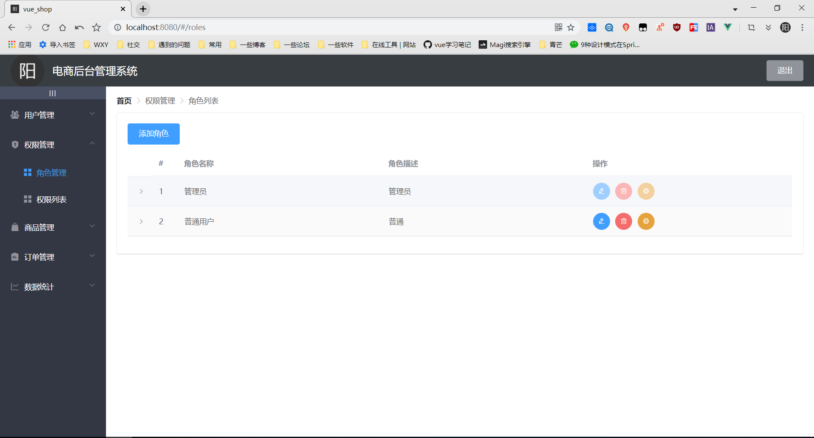
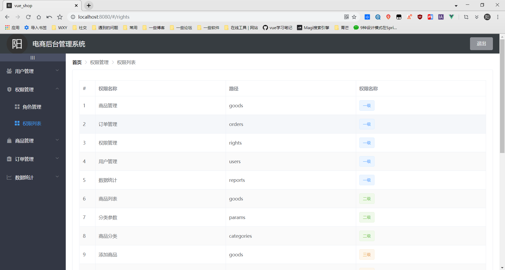

前后端分离项目 使用Springboot+Vue进行开发
## 开发环境
> win10 
> Mysql5.5
>  idea
>  springBoot2.2.2
## 涉及到的技术
### 前端采用技术
> 1.Vue  
> 2.ElementUI  
> 3.axios   
### 后端采用技术
> 1.Spring Boot  
> 2.Spring Data + JPA   
> 3.MySQL  
> 4.Hikari  
> 5.Shiro  
> 6.JWT  
> 7.Redis  

### 登录界面

### 后台主界面 

### 用户管理模块
#### 用户列表

### 权限理模块
#### 角色列表

#### 权限列表

#### 目前处于开发中状态...  

#### 项目码云地址     
> 后端 https://gitee.com/wxyShine/springboot_shop.git  
> 前端 https://gitee.com/wxyShine/vue_shop.git
